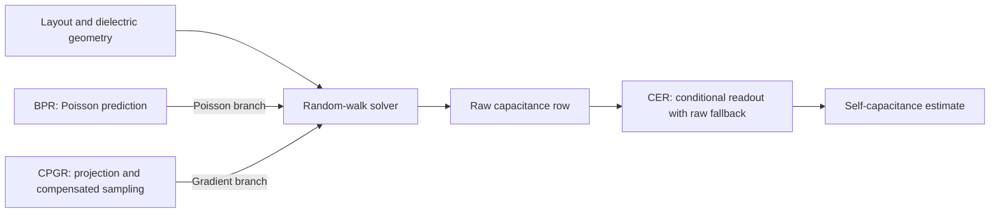

# CARE-RWCap
### Condition-Aware Refinement for Neural-Guided Random-Walk Capacitance Extraction

[中文](README_CN.md) · [Installation](docs/INSTALL.md) · [Method](docs/METHOD.md) · [Evaluation](benchmarks/public10/README.md)

## Introduction

CARE-RWCap refines the neural predictions and capacitance readout of a floating random-walk solver. Built on [DeepRWCap](https://github.com/THU-numbda/deepRWCap), it combines three components:

- **BPR — Baseline-Anchored Poisson Refinement:** a learned adapter around a frozen Poisson predictor.
- **CPGR — Conditional Parity Gradient Refinement:** reflection-conditioned signed-kernel projection, opposite-face probability averaging and sampling compensation, with frozen gradient networks.
- **CER — Conditional Endpoint Re-estimation:** a post-solve readout using the logical-conductor coupling row when the frozen applicability conditions hold, with fallback to raw self capacitance.

This repository provides method source, frozen models, the public ten-case benchmark and upstream CPU baselines. It supports fixed-model inference and evaluation; complete retraining is outside the release scope.

## Overview



The diagram shows the Full configuration. BPR replaces only the Poisson predictor; CPGR operates inside gradient sampling; CER runs after the solve. Reference capacitances are used for evaluation, not for activating CER. Definitions and source locations are in [METHOD.md](docs/METHOD.md) and [PAPER_MAPPING.md](docs/PAPER_MAPPING.md).

## Requirements

| Component | Frozen neural deployment |
|---|---|
| Platform | Ubuntu 24.04, Linux x86_64 |
| GPU | NVIDIA RTX 4090 |
| Python | 3.12 |
| CUDA Toolkit | 12.6 |
| PyTorch / Torch-TensorRT | 2.6.0+cu126 |
| TensorRT | 10.7 |

The supplied deployment engines use FP16 and target this environment. Other GPU/library combinations are not validated. Follow the [installation guide](docs/INSTALL.md) for system libraries and Python dependencies; installing `requirements.txt` alone is insufficient.

Traditional CPU baselines need only Linux x86_64 and Python 3.10+; they do not require the neural environment.

## Quick start

Download or clone this repository, enter its root directory, and complete [installation](docs/INSTALL.md). Then build the extensions and run the bundled case8 example:

```bash
python scripts/check_environment.py --build-only
python scripts/build.py
python scripts/check_environment.py
python scripts/run.py --arm full --output runs/full_case8
```

Every invocation needs a new output directory. The example uses initial seed 2029 and saves:

| File | Contents |
|---|---|
| `result.out` | Solver capacitance and workload output |
| `metrics.json` | Raw/CER estimates, errors, workload and solver timing |
| `run.json` | Actual model selection, configuration and command |
| `console.log`, `result.log` | Execution logs |

CER adds no further solve. To check the implementation:

```bash
python -m unittest discover -s tests -p 'test_*.py'
bash scripts/smoke_test.sh --output runs/smoke
```

The first command needs NumPy but no GPU; the second requires the supported GPU environment. See [validation status](docs/VALIDATION.md) for completed checks and remaining limits.

## Data and pretrained models

All ten public geometries and reference files are included under `benchmarks/public10/`. Frozen settings, selected masters and reference self-capacitances are in `configs/paper_protocol.json`.

| Directory | Contents |
|---|---|
| `models/paper_p0/` | Five FP16 engines for the locally trained DeepRWCap baseline |
| `models/bpr/` | BPR Poisson engine; the other four engines are shared with P0 |
| `models/checkpoints/` | Inspectable FP32 checkpoints and uncompiled TorchScript |
| `benchmarks/public10/` | Public layouts and reference capacitances |

The paper P0 uses DeepRWCap architectures with locally trained weights; it is not the official upstream pretrained model set. CPGR and CER introduce no additional trained checkpoint. See [model provenance](models/README.md).

## Public10 evaluation

| `--arm` | Poisson model | CPGR | Main comparison readout |
|---|---|---|---|
| `p0` | Paper P0 | Off | Raw |
| `bpr` | BPR | Off | CER |
| `full` | BPR | On | CER |

```bash
# Quick comparison: case8, initial seed 2029, three solves
python scripts/benchmark.py --profile quick --output runs/quick

# Inspect the full plan without a GPU or any solves
python scripts/benchmark.py --profile paper --plan-only --output runs/paper_plan

# Ten cases × ten initial seeds × three arms, plus three excluded warmups
python scripts/benchmark.py --profile paper --output runs/public10
```

Each arm retains both raw and CER readouts. Completed batches produce `summary.json` and `summary.md` with per-case statistics, equal-case macro SelfCapErr, same-readout differences, uncertainty, workload and timing. Incomplete batches retain their outputs but do not receive a complete aggregate.

The protocol uses initial seeds **2029–2038**. The [historical reference](results/README.md) identifies the original 300-run cohort. Asynchronous execution can change trajectories, and the incremental CPGR gain has varied in direction across checked batches; the reference is not a guaranteed rerun target or ranking. See [evaluation details](docs/REPRODUCIBILITY.md).

## Traditional baselines

Upstream **FRW-AGF**, **MicroWalk** and **FRW-FDM** executables are bundled with their license and provenance. On Linux x86_64:

```bash
chmod +x third_party/deeprwcap/baselines/rwcap_*
python3 scripts/baselines.py --method agf --output runs/agf_example
python3 scripts/baselines.py --method microwalk --output runs/microwalk_example
python3 scripts/baselines.py --method fdm --output runs/fdm_example

# Optional public10 batch: 100 solves for the selected CPU baseline
python3 scripts/baselines.py --method agf --profile paper --output runs/agf_public10
```

These use raw SelfCapErr without CER, with 16 solver threads by default; the neural protocol uses 8 workers. FRW-FDM can take longer. See [CPU baseline instructions](docs/CPU_BASELINES.md) for output definitions and validation coverage.

## Repository structure

```text
src/bpr/                         BPR architecture and loss
src/readout/                     Output parser and CER
cpp/cpgr/                        Projection, selector and compensation
cpp/seed_control/                Initial neural-solver seed setup
models/                          Frozen engines and inspectable checkpoints
benchmarks/public10/             Public inputs and references
configs/                         Evaluation settings
scripts/                         Build, inference and evaluation
third_party/deeprwcap/           Upstream runtime, CPU baselines and license
results/                         Compact original 300-run reference
tests/                           CPU and GPU implementation checks
docs/                            Installation, method and evaluation details
```

## Release scope

The upstream solver core and traditional baselines are binary dependencies; our refinement and readout implementations are provided as source. Full training data/driver, additional-layout datasets, dedicated memory studies, all research logs and paper-figure scripts are not included.

An optional [local transition evaluator](docs/LOCAL_VALIDATION.md) is available for users who already have the original external reference datasets. Those datasets are not bundled or needed for public10 inference. See the complete [scope](docs/ARTIFACT_SCOPE.md).

## Citation and acknowledgments

Software citation metadata is provided in [CITATION.cff](CITATION.cff). Paper bibliographic details will be added when publicly available.

We thank the DeepRWCap authors for their neural solver, architectures, benchmark cases and baseline executables. If your work uses these upstream components, please also cite:

```bibtex
@article{rodriguez2026deeprwcap,
  title={DeepRWCap: Neural-Guided Random-Walk Capacitance Solver for IC Design},
  author={Rodriguez, Hector R. and Huang, Jiechen and Yu, Wenjian},
  journal={Proceedings of the AAAI Conference on Artificial Intelligence},
  volume={40},
  number={2},
  pages={971--979},
  year={2026},
  doi={10.1609/aaai.v40i2.37066}
}
```

MIT; see [LICENSE](LICENSE) and [THIRD_PARTY_NOTICES.md](THIRD_PARTY_NOTICES.md). Third-party terms are retained. For implementation or installation problems, open a GitHub issue with the command, environment and relevant log excerpt.
