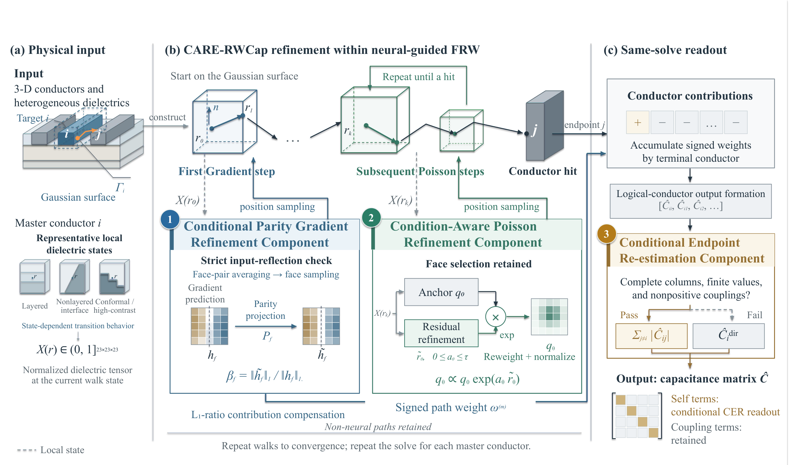

# CARE-RWCap
### Condition-Aware Refinement for Neural-Guided Floating Random Walk Capacitance Extraction

[Installation](docs/INSTALL.md) · [Method](docs/METHOD.md) · [Evaluation](benchmarks/public10/README.md)

## Introduction

CARE-RWCap is a condition-aware refinement framework built on [DeepRWCap](https://github.com/THU-numbda/deepRWCap). It connects local transition refinement, signed sampling contributions and same-solve self-capacitance readout within a floating random walk (FRW) solver.

This repository provides the core implementation, frozen deployment models, ten public benchmark inputs/references and three traditional CPU baselines.

## Overview

[](docs/figures/overview.pdf)

*[Vector PDF](docs/figures/overview.pdf) · [Full-resolution PNG](docs/figures/overview.png)*

Following the numbered stages in the figure:

1. **CPGR — Conditional Parity Gradient Refinement.** At eligible neural first-Gradient transitions, strict input-reflection checks control parity projection and contribution compensation. The deployed joint operator also averages eligible opposite-face probabilities; the Gradient network parameters remain frozen.
2. **BPR — Baseline-Anchored Poisson Refinement.** Subsequent neural Poisson steps use bounded residual reweighting of the in-face conditional distribution, with the frozen anchor and original Poisson face selector.
3. **CER — Conditional Endpoint Re-estimation.** After conductor-hit contributions are accumulated, the same solve supplies raw and conditional coupling-based self-capacitance readouts. Reference values are used only to evaluate error.

The figure describes the full framework; the released runner evaluates one selected master per invocation. The parser expects an already-aggregated logical-conductor row. Exact selector, input-validation and fallback behavior is explained in [paper-to-code mapping](docs/PAPER_MAPPING.md), with formulas in [METHOD.md](docs/METHOD.md).

## Requirements

| Component | Frozen neural deployment |
|---|---|
| Platform | Ubuntu 24.04, Linux x86_64 |
| GPU | NVIDIA RTX 4090 |
| Python | 3.12 |
| CUDA Toolkit | 12.6 |
| PyTorch / Torch-TensorRT | 2.6.0+cu126 |
| TensorRT | 10.7 |

The supplied deployment engines use FP16 and target this environment. Other GPU/library combinations are not validated. Follow the [installation guide](docs/INSTALL.md) for system libraries and Python dependencies; installing `requirements.txt` alone is insufficient.

Traditional CPU baselines need only Linux x86_64 and Python 3.10+; they do not require the neural environment.

## Quick start

Clone the repository and follow [installation](docs/INSTALL.md) to configure the required system libraries and Python environment:

```bash
git clone https://github.com/chmyo-Q/CARE-RWCap.git
cd CARE-RWCap
```

After installation, build the extensions and run the bundled case1 example:

```bash
python scripts/check_environment.py --build-only
python scripts/build.py
python scripts/check_environment.py
python scripts/run.py --arm care-rwcap --output runs/full_case1
```

The default example is **case1**, using `configs/example.json` and the input under `benchmarks/public10/`. This illustrative case had improved mean error in earlier evaluations. A single realization does not estimate the ten-case average; the complete evaluation retains all ten cases.

Every invocation needs a new output directory. The example uses initial seed 2029 and saves:

| File | Contents |
|---|---|
| `result.out` | Solver capacitance and workload output |
| `metrics.json` | Raw/CER estimates, errors, workload and solver timing |
| `run.json` | Actual model selection, configuration and command |
| `console.log`, `result.log` | Execution logs |

CER adds no further solve. To check the implementation:

```bash
python -m unittest discover -s tests -p 'test_*.py'
bash scripts/smoke_test.sh --output runs/smoke
```

The first command needs NumPy but no GPU; the second requires the supported GPU environment. The smoke test explicitly uses `configs/smoke_case7.json` so that both CPGR activation and the CER coupling-sum branch are exercised. See [validation status](docs/VALIDATION.md) for completed checks and remaining limits.

## Data and pretrained models

All ten public geometries and reference files are included under `benchmarks/public10/`. Frozen settings, selected masters and reference self-capacitances are in `configs/paper_protocol.json`.

| Directory | Contents |
|---|---|
| [DeepRWCap models](models/README.md) | Five FP16 engines for the locally trained DeepRWCap baseline |
| `models/bpr/` | BPR Poisson engine; the other four engines are shared with DeepRWCap |
| `models/checkpoints/` | Inspectable FP32 checkpoints and uncompiled TorchScript |
| `benchmarks/public10/` | Public layouts and reference capacitances |

The bundled DeepRWCap baseline uses the upstream architectures with locally trained weights; it is not the official upstream pretrained model set. CPGR and CER introduce no additional trained checkpoint. See [model provenance](models/README.md).

For new local Poisson/Gradient data, the optional [GGFT generation workflow](docs/DATA.md) uses a fixed upstream source revision and a CPU-only entry, `scripts/generate_data.py`. It documents generation settings, the binary format and BPR preprocessing. Generated data do not replace the frozen paper reference files or retrain the bundled models.

## Public10 evaluation

| `--arm` | Poisson model | CPGR | Main comparison readout |
|---|---|---|---|
| `deeprwcap` | DeepRWCap | Off | Raw |
| `bpr` | BPR | Off | CER |
| `care-rwcap` | BPR | On | CER |

```bash
# Inspect the full plan without a GPU or any solves
python scripts/benchmark.py --profile paper --plan-only --output runs/paper_plan

# Ten cases × ten initial seeds × three arms, plus three excluded warmups
python scripts/benchmark.py --profile paper --output runs/public10
```

For a small repeated comparison, the quick profile uses **case1**, initial seeds **2029–2031**, and three arms: nine solves in total.

```bash
python scripts/benchmark.py --profile quick --output runs/quick
```

Case1 was selected as an illustrative case with lower CARE-RWCap mean error in prior evaluations. Its [archived ten-repeat](results/reference_public10.json) mean was **0.7542%**, versus **0.8875%** for DeepRWCap raw. The quick command evaluates all three predefined seeds and reports their new means; stochastic values and rankings can differ from the archive.

Use the full profile for a ten-case performance comparison. The default single run also uses case1; the smoke test retains its separate case7 configuration. Each conditional module follows its usual activation or fallback rule in the case1 examples.

Each arm retains both raw and CER readouts. Completed batches produce `summary.json` and `summary.md` with per-case statistics, equal-case macro SelfCapErr, same-readout differences, uncertainty, workload and timing. Incomplete batches retain their outputs but do not receive a complete aggregate.

The protocol uses initial seeds **2029–2038**. The [historical reference](results/README.md) identifies the original 300-run cohort. Asynchronous execution can change trajectories, and the incremental CPGR gain has varied in direction across checked batches; the reference is not a guaranteed rerun target or ranking. See [evaluation details](docs/REPRODUCIBILITY.md).

## Reference results

The original public10 batch contains ten runs per case and solver arm. Macro SelfCapErr gives each case equal weight.

| Configuration | Macro SelfCapErr (%) |
|---|---:|
| DeepRWCap, raw | 0.9278 |
| BPR + CER | 0.9001 |
| CARE-RWCap: BPR + CPGR + CER | 0.8110 |

[Complete raw/CER results](results/README.md) identify the measured configurations and their shared-solve readouts. The [paper-to-code guide](docs/PAPER_MAPPING.md) lists which experiments the release supports.

In a separate evaluation of three previously selected BPR checkpoints, the Full-method macro errors were 0.8112%, 0.8038% and 0.8414% (mean ± sample SD: **0.8188 ± 0.0199%**). This study reused the historical DeepRWCap baseline. Its [records and protocol](results/training_seeds/README.md) include all 300 Full observations and 100 reused DeepRWCap observations. Recompute its tables without a GPU:

```bash
python scripts/summarize_training_seeds.py --output outputs/training_seed_summary
```

This command reaggregates saved capacitances. The inference runner uses the bundled training-seed2029 model; the two additional model files are not included in the compact supplement.

## Optional traditional baselines

Upstream **FRW-AGF**, **MicroWalk** and **FRW-FDM** executables are bundled with their license and provenance. On Linux x86_64:

```bash
chmod +x third_party/deeprwcap/baselines/rwcap_*
python3 scripts/baselines.py --method agf --output runs/agf_example
python3 scripts/baselines.py --method microwalk --output runs/microwalk_example
python3 scripts/baselines.py --method fdm --output runs/fdm_example

# Optional public10 batch: 100 solves for the selected CPU baseline
python3 scripts/baselines.py --method agf --profile paper --output runs/agf_public10
```

These use raw SelfCapErr without CER, with 16 solver threads by default; the neural protocol uses 8 workers. FRW-FDM can take longer. See [CPU baseline instructions](docs/CPU_BASELINES.md) for output definitions and validation coverage.

## Repository structure

```text
src/bpr/                         BPR architecture and loss
src/readout/                     Output parser and CER
cpp/cpgr/                        Projection, selector and compensation
cpp/seed_control/                Initial neural-solver seed setup
models/                          Frozen engines and inspectable checkpoints
benchmarks/public10/             Public inputs and references
configs/                         Evaluation settings
scripts/                         Build, inference and evaluation
third_party/deeprwcap/           Upstream runtime, CPU baselines and license
results/                         Main reference and training-seed supplement
tests/                           CPU and GPU implementation checks
docs/                            Installation, method and evaluation details
docs/figures/                    Framework PNG and vector PDF
```

## Release scope

For a first CARE-RWCap run, follow **Quick start**. The framework figure, traditional CPU baselines, training-seed result supplement and local transition evaluator are optional; they are not prerequisites for that run. The local transition evaluator requires external datasets that are not included.

| What you want to do | Start here |
|---|---|
| Install and run a case | [Installation](docs/INSTALL.md) and Quick start above |
| Generate new Poisson/Gradient data | [GGFT source, format and generation](docs/DATA.md) |
| Understand BPR, CPGR and CER | [Method](docs/METHOD.md) and [paper-to-code mapping](docs/PAPER_MAPPING.md) |
| Evaluate the ten public cases | [Benchmark commands](benchmarks/public10/README.md) and [protocol](docs/REPRODUCIBILITY.md) |
| Check what has actually been tested | [Validation status](docs/VALIDATION.md) |
| Understand included and omitted material | [Release scope](docs/ARTIFACT_SCOPE.md) |


The upstream solver core and traditional baselines are binary dependencies; our refinement and readout implementations are provided as source. Full training data/driver, additional-layout datasets, dedicated memory studies, all research logs and paper-figure scripts are not included.

An optional [local transition evaluator](docs/LOCAL_VALIDATION.md) is available for users who already have the original external reference datasets. Those datasets are not bundled or needed for public10 inference. See the complete [scope](docs/ARTIFACT_SCOPE.md).

## Citation and acknowledgments

The manuscript title is **CARE-RWCap: Condition-Aware Refinement for Neural-Guided Floating Random Walk Capacitance Extraction**. [CITATION.cff](CITATION.cff) contains software citation metadata. The citation metadata follows the current manuscript. No publication DOI, volume or issue has been assigned in this repository.

We thank the DeepRWCap authors for their neural solver, architectures, benchmark cases and baseline executables. If your work uses these upstream components, please also cite:

```bibtex
@article{rodriguez2026deeprwcap,
  title={DeepRWCap: Neural-Guided Random-Walk Capacitance Solver for IC Design},
  author={Rodriguez, Hector R. and Huang, Jiechen and Yu, Wenjian},
  journal={Proceedings of the AAAI Conference on Artificial Intelligence},
  volume={40},
  number={2},
  pages={971--979},
  year={2026},
  doi={10.1609/aaai.v40i2.37066}
}
```

MIT; see [LICENSE](LICENSE) and [THIRD_PARTY_NOTICES.md](THIRD_PARTY_NOTICES.md). Third-party terms are retained. For implementation or installation problems, open a GitHub issue with the command, environment and relevant log excerpt.
