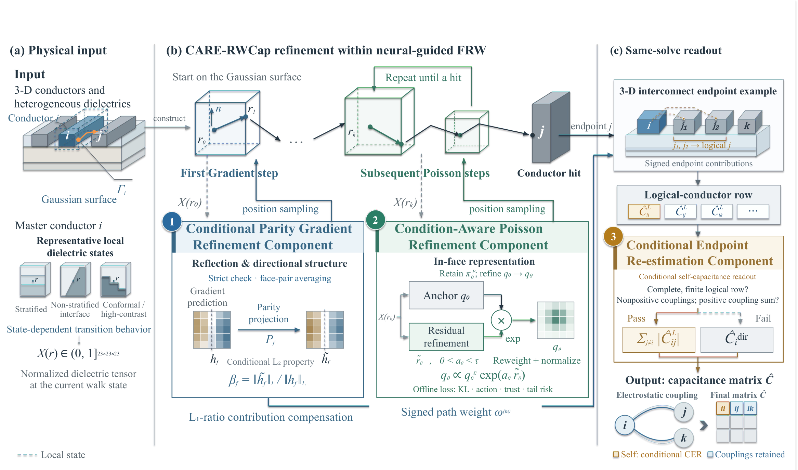

# CARE-RWCap

**Condition-Aware Refinement for Neural-Guided Floating Random Walk Capacitance Extraction**

[Installation](docs/INSTALL.md) · [Method](docs/METHOD.md) · [Evaluation](docs/EVALUATION.md) · [Data](https://github.com/chmyo-Q/CARE-RWCap/blob/6cb1510b7a0a7c8996afd31d1683d7580e020694/docs/DATA.md)

CARE-RWCap refines local transitions and endpoint readout in the [DeepRWCap](https://github.com/THU-numbda/deepRWCap) floating random walk solver. It includes the refinement code, pretrained models, ten public benchmarks, five additional evaluation layouts and scripts for running the experiments.

## Overview

[](docs/figures/overview.pdf)

1. **CPGR — Conditional Parity Gradient Refinement:** at eligible first neural Gradient transitions, average opposite-face probabilities, project signed kernels and compensate contributions under strict input symmetry. Gradient network parameters stay frozen.
2. **CAPR — Condition-Aware Poisson Refinement:** refine subsequent Poisson in-face distributions through bounded residual reweighting, retaining the frozen anchor and Poisson face selector.
3. **CER — Conditional Endpoint Re-estimation:** obtain raw and conditional coupling-based self-capacitance readouts from the same solve.

The runner evaluates one selected master per invocation. [Method](docs/METHOD.md) describes the operators, input/fallback rules and manuscript-to-source mapping.

## Install and run

The frozen FP16 engines target **Ubuntu 24.04 / Linux x86_64, RTX 4090, Python 3.12, CUDA Toolkit 12.6, Torch/Torch-TensorRT 2.6.0+cu126 and TensorRT 10.7**. Follow [installation](docs/INSTALL.md) to set up the system libraries and Python dependencies.

```bash
git clone https://github.com/chmyo-Q/CARE-RWCap.git
cd CARE-RWCap
python scripts/check_environment.py --build-only
python scripts/build.py
python scripts/check_environment.py
python scripts/run.py --arm care-rwcap --output runs/full_case1
```

The default case1 example uses initial seed 2029. Each invocation needs a new output directory and saves `result.out`, `metrics.json`, `run.json` and logs. Metrics include raw/CER estimates, SelfCapErr, walks, hops and solver time. CER requires no extra solve.

Check the CPU logic or run the case7 smoke workflow:

```bash
python -m unittest discover -s tests -p 'test_*.py'
bash scripts/smoke_test.sh --output runs/smoke
```

CPU tests need NumPy but no GPU. Smoke uses `configs/smoke_case7.json` to exercise CPGR activation and CER application; it needs the supported GPU environment.

## Evaluate public10

| `--arm` | Poisson predictor | CPGR | Main readout |
|---|---|---|---|
| `deeprwcap` | DeepRWCap | Off | Raw |
| `capr` | CAPR | Off | CER |
| `care-rwcap` | CAPR | On | CER |

```bash
# Small comparison: case1, seeds 2029–2031, three arms (nine solves)
python scripts/benchmark.py --profile quick --output runs/quick

# Inspect the full plan without a GPU or any solves
python scripts/benchmark.py --profile paper --plan-only --output runs/paper_plan

# Ten cases × ten seeds × three arms, plus three excluded warmups
python scripts/benchmark.py --profile paper --output runs/public10
```

Each solve saves both raw and CER readouts. The quick profile runs case1 with three seeds; the paper profile runs all ten cases with seeds 2029–2038. See [benchmark commands](benchmarks/public10/README.md) for arm selection and outputs, and [evaluation](docs/EVALUATION.md) for metric definitions.

## Models and experiments

The [model guide](models/README.md) describes the FP16 engines and FP32 checkpoints. The baseline weights were trained locally using the DeepRWCap architectures. [Paper results](results/README.md) identifies the original experiment and readout definitions.

## Optional research tools

The [research-tools package](https://github.com/chmyo-Q/CARE-RWCap/releases/download/v0.1.0-core/CARE-RWCap-research-tools.zip) adds CPU baselines, GGFT generation, local transition evaluation, training-seed records and the remaining FP32 baseline checkpoints. Install it into the repository root:

```bash
curl -fL https://github.com/chmyo-Q/CARE-RWCap/releases/download/v0.1.0-core/CARE-RWCap-research-tools.zip -o /tmp/CARE-RWCap-research-tools.zip
unzip /tmp/CARE-RWCap-research-tools.zip -d .
```

See [Installation](docs/INSTALL.md#optional-research-tools) for the added commands and data requirements.

## Code layout

```text
src/capr/              CAPR model and loss
src/readout/           CER and capacitance parsing
cpp/cpgr/              CPGR sampling and kernel projection
cpp/seed_control/      Solver initialization
scripts/               Build, run and evaluation commands
scripts/_internal/     Shared validation and statistics helpers
models/                Deployment engines and FP32 checkpoints
benchmarks/            Layouts and reference capacitances
configs/               Run and validation settings
third_party/           DeepRWCap runtime and CPU baselines
```

## Citation and license

[CITATION.cff](CITATION.cff) contains the manuscript title and authors; publication details will be added when available. Please also cite DeepRWCap when using its components:

```bibtex
@article{rodriguez2026deeprwcap,
  title={DeepRWCap: Neural-Guided Random-Walk Capacitance Solver for IC Design},
  author={Rodriguez, Hector R. and Huang, Jiechen and Yu, Wenjian},
  journal={Proceedings of the AAAI Conference on Artificial Intelligence},
  volume={40}, number={2}, pages={971--979}, year={2026},
  doi={10.1609/aaai.v40i2.37066}
}
```

MIT; see [LICENSE](LICENSE) and [THIRD_PARTY_NOTICES.md](THIRD_PARTY_NOTICES.md). We thank the DeepRWCap authors for the solver, architectures, benchmarks and baseline executables. For problems, open an issue with the command, environment and relevant log excerpt.
