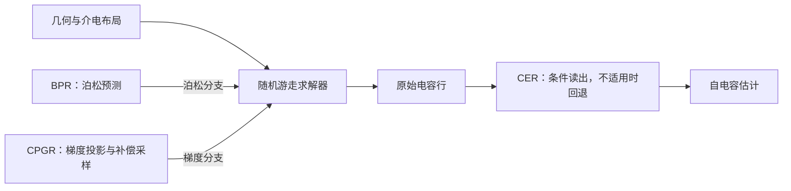

# CARE-RWCap
### 面向神经引导随机游走电容提取的条件感知修正

[English](README.md) · [安装](docs/INSTALL.md) · [方法](docs/METHOD.md) · [评估](benchmarks/public10/README.md)

## 项目简介

CARE-RWCap 基于 [DeepRWCap](https://github.com/THU-numbda/deepRWCap)，在泊松预测、梯度采样和最终电容读出处加入三个组件：

- **BPR（Baseline-Anchored Poisson Refinement）**：以冻结的泊松预测器为锚点，学习轻量修正。
- **CPGR（Conditional Parity Gradient Refinement）**：根据输入的严格反射条件，实施有符号梯度核投影、对置面概率平均及采样补偿；梯度网络参数保持冻结。
- **CER（Conditional Endpoint Re-estimation）**：满足固定适用条件时，从逻辑导体的耦合电容行重新读出自电容，否则保留原始自电容。

本包提供方法实现、冻结模型、公开十案例及上游传统CPU基线，用于冻结模型推理与评估。完整训练工程不在公开范围内。

## 方法流程



图示对应 Full 配置。BPR 仅替换泊松预测器，CPGR 接入梯度采样路径，CER 在求解结束后执行。参考电容只参与误差评估，不用于决定 CER 是否激活。详见[方法说明](docs/METHOD.md)及[论文术语对应](docs/PAPER_MAPPING.md)。

## 环境与快速开始

冻结神经引擎对应 Ubuntu 24.04 / Linux x86_64、RTX 4090、Python 3.12、CUDA Toolkit 12.6、Torch/Torch-TensorRT 2.6.0+cu126 和 TensorRT 10.7，采用 FP16 部署。未验证其他 GPU/软件组合。

下载或克隆仓库，进入根目录，先按[安装说明](docs/INSTALL.md)配置系统库与 Python 依赖，再执行：

```bash
python scripts/check_environment.py --build-only
python scripts/build.py
python scripts/check_environment.py
python scripts/run.py --arm full --output runs/full_case8
```

输出目录必须是新目录。示例使用 case8、初始 seed 2029，保存 `result.out`、`metrics.json`、`run.json` 和日志，包含 raw/CER 电容、误差、walks、hops 和求解器耗时。CER 不额外运行一次求解。

```bash
python -m unittest discover -s tests -p 'test_*.py'
bash scripts/smoke_test.sh --output runs/smoke
```

第一条需要 NumPy，但不需要 GPU；第二条需要受支持的 GPU 环境。[验证说明](docs/VALIDATION.md)区分当前检查与此前 GPU 验收。

## 数据与模型

| 目录 | 内容 |
|---|---|
| `models/paper_p0/` | 本地训练的 DeepRWCap 基线的五个 FP16 引擎 |
| `models/bpr/` | BPR 泊松引擎，其余四个引擎与 P0 共享 |
| `models/checkpoints/` | FP32 权重与未编译 TorchScript |
| `benchmarks/public10/` | 十案例几何与参考电容 |
| `configs/paper_protocol.json` | 选定主导体、参考值、运行参数和 seed 协议 |

论文 P0 采用 DeepRWCap 架构，但并非官方发布的预训练权重。CPGR、CER 不新增训练检查点。模型来源见 [models/README.md](models/README.md)。

## 十案例评估

| 组名 | 泊松模型 | CPGR | 主比较读出 |
|---|---|---|---|
| `p0` | Paper P0 | 关闭 | raw |
| `bpr` | BPR | 关闭 | CER |
| `full` | BPR | 开启 | CER |

```bash
# 单 case8、seed 2029、三组快速检查
python scripts/benchmark.py --profile quick --output runs/quick

# 只生成完整计划，不启动求解
python scripts/benchmark.py --profile paper --plan-only --output runs/paper_plan

# 10 case × 10 seed × 3组，共300次正式求解，另有3次预热
python scripts/benchmark.py --profile paper --output runs/public10
```

各组同时保留 raw/CER，完整批次输出 `summary.json` 和 `summary.md`，包括逐case统计、等权宏平均、同口径差异、不确定性与采样/耗时指标。失败时保留输出；不完整批次不生成完整性能汇总。

协议采用初始 seeds **2029–2038**；训练和单案例默认 seed 是 **2029**。[历史参考](results/README.md)仅对应原始300-run。异步执行可能改变轨迹，已核验批次间 CPGR 增量收益的方向也曾变化，因此不承诺新批次必然获得相同均值或排序。更多定义见[评估协议](docs/REPRODUCIBILITY.md)。

## 传统 CPU 基线

附带上游 FRW-AGF、MicroWalk、FRW-FDM 二进制及其许可证。在 Linux x86_64 下，仅需 Python 3.10+ 标准库，无需神经网络环境：

```bash
chmod +x third_party/deeprwcap/baselines/rwcap_*
python3 scripts/baselines.py --method agf --output runs/agf_example
python3 scripts/baselines.py --method microwalk --output runs/microwalk_example
python3 scripts/baselines.py --method fdm --output runs/fdm_example
# 可选：所选CPU基线的完整100次评估
python3 scripts/baselines.py --method agf --profile paper --output runs/agf_public10
```

默认16线程，使用 raw SelfCapErr，不应用 CER；神经方法默认8个 worker。FRW-FDM 可能耗时较长。输出范围和实际验收状态见 [CPU基线说明](docs/CPU_BASELINES.md)。

## 目录与范围

```text
src/bpr/                         BPR网络与损失
src/readout/                     电容解析与CER
cpp/cpgr/                        投影、选择器与补偿
cpp/seed_control/                初始seed设置
models/                          冻结引擎与可检查权重
benchmarks/public10/             十案例输入与参考
configs/                         运行设置
scripts/                         编译、推理、评估
third_party/deeprwcap/           上游运行库、传统基线及许可证
results/                         原300-run紧凑历史参考
tests/                           CPU/GPU实现检查
docs/                            安装、方法和评估细节
```

本项目修正模块和读出逻辑提供源码；上游求解核心与传统基线按二进制形式提供。完整训练数据/驱动、额外layout数据、专用显存实验、全部研发日志和论文绘图工程不在本包内。

[可选局部评估入口](docs/LOCAL_VALIDATION.md)需要用户已有原始参考数据，这些数据未随包提供，也不是运行public10的前提。详见[公开范围](docs/ARTIFACT_SCOPE.md)。

## 引用、致谢与反馈

软件引用信息见 [CITATION.cff](CITATION.cff)，论文正式书目信息将在公开后补充。感谢 DeepRWCap 作者提供神经求解器、网络结构、测试案例和基线程序；使用这些上游组件时，也请引用原论文，BibTeX 见[英文首页](README.md#citation-and-acknowledgments)。

许可证见 [LICENSE](LICENSE) 和 [THIRD_PARTY_NOTICES.md](THIRD_PARTY_NOTICES.md)。安装或实现问题可通过 GitHub Issues 提交，请附运行命令、环境及相关日志片段。
